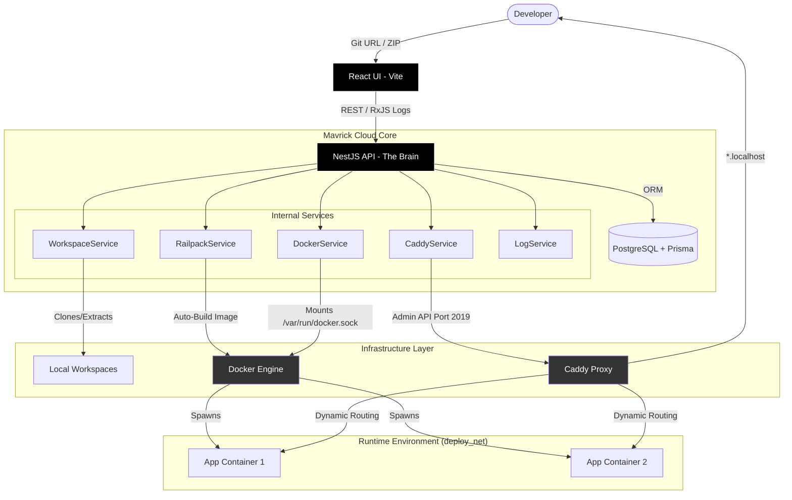

# Mavrick Cloud

Mavrick Cloud is a minimal open-source deployment platform for developers who want a sleek, high-contrast, and reliable way to build and run containerized applications.

## 🗺️ System Architecture



## 🏁 Quick Start

### Prerequisites

- [Docker](https://docs.docker.com/get-docker/) & Docker Compose. Ensure docker is running and accessible.
- Node.js 20+ (for local development)

### Setup & Run

1. **Clone the repository**:

    ```bash
    git clone https://github.com/debelistic/mavrick-cloud.git
    cd mavrick-cloud
    ```

2. **Spin up the infrastructure**:

    ```bash
    docker compose up --build
    ```

3. **Access the Dashboard**:
    Open `http://localhost:5173` in your browser.
    test repos:
    - <https://github.com/debelistic/payment-microservice>
    - <https://github.com/debelistic/nodeAPI>

4. **Deploy an app**:
    Use the dashboard to enter a Git URL or upload a ZIP file. Your app will be accessible at `http://{deployment-id}.localhost`.

---

## 🏗️ Architecture

Mavrick Cloud is built with a focus on simplicity, speed, and standard tools:

- **API (NestJS)**: The brain of the operation. Manages deployments, workspace cloning, log streaming (via RxJS), and Docker orchestration.
- **UI (Vite + React)**: A high-contrast, monochrome dashboard designed for technical clarity.
- **Proxy (Caddy)**: Handles dynamic routing. We use Caddy's Admin API to instantly register new deployment subdomains without restarts.
- **Database (PostgreSQL + Prisma)**: Persists deployment history, container state, and build logs.
- **Build Engine (Railpack)**: Automatically detects and builds application images without requiring a `Dockerfile`.

### Core Features

- **Real-time Logs**: Streaming build and application output.
- **Persistence**: Automatically recovers and restarts deployments after platform reboots.
- **HSTS Stripping**: Automatically manages security headers to ensure seamless local development on HTTP.
- **Secure Local Domains**: Uses `*.localhost` subdomains to provide a "Secure Context" in modern browsers without complex SSL setup.

---

## 🛠️ Technical Implementation Notes

### Dynamic Routing

Mavrick Cloud communicates with Caddy over its internal Admin port (2019). When a new deployment is ready, the API prepends a host-matching route to Caddy's configuration, ensuring that specific deployments take priority over the platform's default API/UI routes.

### Docker Integration

The platform mounts `/var/run/docker.sock` to the API container, allowing it to manage the sibling containers that run your apps. All apps are connected to a shared `deploy_net` network.

### Monochrome Design System

The UI follows a strict black-and-white aesthetic, using high-contrast borders and monospaced typography to emphasize technical data and logs.

---

#### How Does the API Work?

The core of the API is the `DeploymentsService` class, which is responsible for creating and managing deployments. It uses the `RailpackService` to build the image, the `DockerService` to start the container, and the `CaddyService` to register the route. All of these services use the `WorkspaceService` to create and manage workspaces.

- A user enters a public url to a github repo OR uploads a .zip file.
- The deployment service creates a new workspace for the deployment and clones the repo OR extracts the zip file.
- The deployment service builds the image using railpack.
- The deployment service starts the container.
- The deployment service registers the container with Caddy.
- The deployment service updates the internal database with the deployment status and other relevant information such as imageTag, containerId, publicUrl, and id.
- The deployment status is updated to `RUNNING` upon successful deployment.
- If any of the above steps fail, the deployment status is updated to `FAILED` and the workspace is cleaned up.

#### Core API Services

The core API services are: `WorkspaceService`, `RailpackService`, `DockerService`, `CaddyService`, `LogService`, and `PrismaService`.

- `WorkspaceService`: Creates and manages workspaces.
- `RailpackService`: Builds the image.
- `DockerService`: Starts the container.
- `CaddyService`: Registers the container with Caddy.
- `LogService`: Manages logs.
- `PrismaService`: Manages the database.

#### How Does the UI Work?

- user enters a public url to a github repo OR uploads a .zip file.(<https://github.com/debelistic/payment-microservice>, <https://github.com/debelistic/nodeAPI>)
- the UI creates a new database entry for the deployment with status `PENDING`.
- the UI starts a background process to process the deployment.
- the background process creates a new workspace for the deployment and clones the repo OR extracts the zip file.
- the background process builds the image using railpack.
- the background process starts the container.
- the background process registers the container with Caddy.
- the background process updates the deployment status to `RUNNING`.

#### Time It took
it 6-8 hours

## 📜 License

MIT
